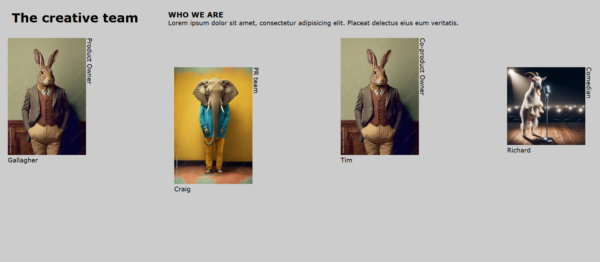

<h1 align="center">Media Query 2</h1>

  <h3>
    <a href="https://ande-glitch.github.io/Media-Query-2/">
      Link to project
    </a>
  </h3>

<!-- TABLE OF CONTENTS -->

## Table of Contents

- [Overview](#overview)
- [Built With](#built-with)
- [Features](#features)
- [How to use](#how-to-use)
- [Contact](#contact)

<!-- OVERVIEW -->
## Overview
A project made by combining both a well structured index, and thereafter using CSS to adjust differing changes during website resizing. 

### Built With
- [HTML](https://www.w3schools.com/html/)
- [CSS](https://www.w3schools.com/css/default.asp)
- [YouTube](https://www.youtube.com/watch?v=WzLuTCRpvag&list=PL5e68lK9hEzciaR-CFduKDww_AVVUw66y&index=4&ab_channel=OnlineTutorials)

## Features
- Min-max width media queries
- Vertical writing mode
- Responsive to website size
- Wrap images

## How To Use

- Change size accordingly to change the website's look and structure.

## Contact
- GitHub [Ande-Glitch](https://github.com/Ande-glitch)
- Epost [And Nguyen](mailto:andnguyen24@outlook.com)

## Result

